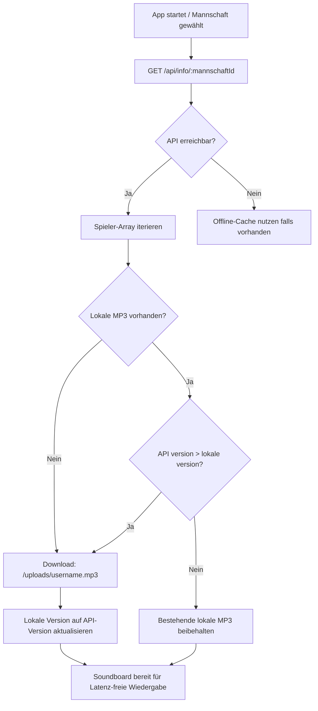

# 7secs – API Dokumentation für Mobile Apps (iOS & Android)

> **Base URL:** `https://sound.beugelbuddel.de` (Produktion) / `http://localhost:3000` (Lokale Entwicklung)  
> Alle API-Endpunkte beginnen mit `/api/`. Sie erfordern **keine Authentifizierung** (öffentlich abrufbar) und sind speziell für mobile Clients (iOS, Android, Flutter, React Native) optimiert.

---

## Inhaltsverzeichnis

1. [Überblick & Architektur](#überblick--architektur)
2. [Datenmodelle](#datenmodelle)
   - [Mannschaft](#mannschaft)
   - [Spieler (Player)](#spieler-player)
3. [REST-Endpunkte](#rest-endpunkte)
   - [1. Alle Mannschaften abrufen](#1-alle-mannschaften-abrufen)
   - [2. Spieler einer Mannschaft abrufen](#2-spieler-einer-mannschaft-abrufen)
   - [3. Alle aktiven Spieler mit Sound abrufen](#3-alle-aktiven-spieler-mit-sound-abrufen)
4. [Sound-Dateien (MP3) & Streaming](#sound-dateien-mp3--streaming)
5. [Caching- & Synchronisations-Konzept](#caching---synchronisations-konzept)
6. [7-Sekunden-Soundboard UX-Logik](#7-sekunden-soundboard-ux-logik)
7. [Fehlerbehandlung & HTTP-Statuscodes](#fehlerbehandlung--http-statuscodes)
8. [Code-Beispiele](#code-beispiele)
   - [Swift (iOS / SwiftUI)](#swift-ios--swiftui)
   - [Kotlin (Android / Jetpack Compose)](#kotlin-android--jetpack-compose)
   - [Dart (Flutter)](#dart-flutter)

---

## Überblick & Architektur

Die `7secs`-Backend-API stellt Torsongs und Spielerdaten für Hallen-Soundboards bereit. 

- **Format:** `application/json; charset=utf-8`
- **Authentifizierung:** Keine für `/api/*` und `/uploads/*`.
- **Performance:** Leichtgewichtig, optimiert für schnelles Laden und Offline-Caching in Sporthallen mit schlechter Netzabdeckung.
- **Filter-Garantie:** Die Endpunkte `/api/info` und `/api/info/:mannschaftId` liefern **nur spielbereite Spieler** zurück, d. h.:
  - `active === true` (im Kader aktiviert)
  - `version > 0` (mindestens ein MP3-Torsong hochgeladen)

---

## Datenmodelle

### Mannschaft

Repräsentiert ein Team mit einer eindeutigen 3-stelligen Mannschafts-ID (z. B. `#H4R`).

```json
{
  "id": "#H4R",
  "name": "1. Herren",
  "ownerId": "00000000-0000-0000-0000-000000000001",
  "createdAt": "2024-01-01T00:00:00.000Z"
}
```

| Feld | Typ | Nullable | Beschreibung |
|---|---|---|---|
| `id` | `string` | Nein | Eindeutige Mannschafts-ID. Beginnt mit `#` gefolgt von 3 Zeichen (z. B. `#H4R`, `#D4M`). |
| `name` | `string` | Nein | Anzeigename der Mannschaft (z. B. `"1. Herren"`). |
| `ownerId` | `string` | Nein | UUID des erstellenden Administrators. |
| `createdAt` | `string` | Nein | ISO-8601-Zeitstempel der Erstellung. |

---

### Spieler (Player)

Repräsentiert einen Spieler mit verknüpftem Torsong.

```json
{
  "id": "e6679840-05ae-11ec-bd14-07787afd9461",
  "username": "tommarienfeld",
  "anzeigename": "Tom M.",
  "mannschaftId": "#H4R",
  "version": 3,
  "active": true
}
```

| Feld | Typ | Nullable | Beschreibung |
|---|---|---|---|
| `id` | `string` | Nein | Eindeutige UUID des Spielers. |
| `username` | `string` | Nein | Eindeutiger Slug (alphanumerisch, Kleinschreibung, ohne Leerzeichen/Umlaute). Bildet den Dateinamen der MP3: `/uploads/{username}.mp3`. |
| `anzeigename` | `string` | Nein | Der auf dem Soundboard anzuzeigende Name (z. B. `"Tom M."` oder `"Lasse"`). |
| `mannschaftId` | `string` | Nein | ID der zugehörigen Mannschaft (z. B. `"#H4R"`). |
| `version` | `number` | Nein | Sound-Versionszähler (Ganzzahl $\ge 1$ in API-Antworten). Jeder Neu-Upload erhöht diesen Wert um `1`. Dient zur Cache-Invalidierung in der App. |
| `active` | `boolean` | Nein | Sichtbarkeitsstatus (`true` = aktiv/im Spieltagskader). |

---

## REST-Endpunkte

### 1. Alle Mannschaften abrufen

Liefert die Liste aller registrierten Mannschaften.

```http
GET /api/mannschaften HTTP/1.1
Host: <server>:3000
Accept: application/json
```

#### Response: `200 OK`

```json
[
  {
    "id": "#H4R",
    "name": "Herren",
    "ownerId": "00000000-0000-0000-0000-000000000001",
    "createdAt": "2024-01-01T00:00:00.000Z"
  },
  {
    "id": "#D4M",
    "name": "Damen",
    "ownerId": "00000000-0000-0000-0000-000000000001",
    "createdAt": "2024-01-01T00:00:00.000Z"
  }
]
```

---

### 2. Spieler einer Mannschaft abrufen

Liefert alle aktiven Spieler mit vorhandenem Sound für eine bestimmte Mannschafts-ID.

```http
GET /api/info/:mannschaftId HTTP/1.1
Host: <server>:3000
Accept: application/json
```

#### URL-Parameter & Format-Unterstützung:

Das Backend unterstützt **beide** Schreibweisen flexibel:

| Parameter | Unterstützte Werte | Empfehlung für Apps |
|---|---|---|
| `mannschaftId` | `H4R` oder `%23H4R` / `#H4R` | **`H4R` (ohne `#`)** – Erfordert kein URL-Percent-Encoding. |

**Beispiel-Aufrufe:**
- `GET /api/info/H4R` *(Empfohlen)*
- `GET /api/info/%23H4R` *(URL-encoded `#H4R`)*

#### Response: `200 OK`

```json
[
  {
    "id": "e6679840-05ae-11ec-bd14-07787afd9461",
    "username": "tommarienfeld",
    "anzeigename": "Tom M.",
    "mannschaftId": "#H4R",
    "version": 2,
    "active": true
  },
  {
    "id": "a3e1c380-ba2a-11f0-b03a-8d7cb4a18635",
    "username": "joost",
    "anzeigename": "Joost",
    "mannschaftId": "#H4R",
    "version": 1,
    "active": true
  }
]
```

> **Hinweis bei leerem Kader oder unbekannter ID:**  
> Gibt ebenfalls HTTP `200 OK` mit einem leeren Array `[]` zurück (kein 404).

---

### 3. Alle aktiven Spieler mit Sound abrufen

Liefert alle aktiven Spieler mit Sound über alle Mannschaften hinweg.

```http
GET /api/info HTTP/1.1
Host: <server>:3000
Accept: application/json
```

#### Response: `200 OK`

```json
[
  {
    "id": "e6679840-05ae-11ec-bd14-07787afd9461",
    "username": "tommarienfeld",
    "anzeigename": "Tom M.",
    "mannschaftId": "#H4R",
    "version": 2,
    "active": true
  },
  {
    "id": "9278b9a0-ba2f-11f0-95fe-036b58bf7b0b",
    "username": "lenas",
    "anzeigename": "Lena S.",
    "mannschaftId": "#D1N",
    "version": 1,
    "active": true
  }
]
```

---

## Sound-Dateien (MP3) & Streaming

Jeder Torsong ist als statische Datei öffentlich abrufbar:

```http
GET /uploads/{username}.mp3 HTTP/1.1
Host: <server>:3000
```

- **MIME-Type:** `audio/mpeg`
- **Range-Requests:** Unterstützt HTTP `206 Partial Content` (wichtig für direktes Streaming und Seek).
- **Dateiname:** Entspricht dem `username`-Attribut des Spielers aus dem JSON-Payload + `.mp3`.

**Beispiel:**
`http://<server>:3000/uploads/tommarienfeld.mp3`

---

## Caching- & Synchronisations-Konzept

In Sporthallen ist die Netzverbindung oft instabil. Die App sollte Torsongs **lokal cachen** und bei Versionserhöhung im Hintergrund aktualisieren.

### Empfohlener Sync-Algorithmus:



### Cache-Schlüssel:
Speichere die Datei lokal unter:  
`<AppCacheDirectory>/sounds/{username}_v{version}.mp3`  
oder verwalte eine Key-Value-Tabelle: `(username) -> { localPath, version }`.

---

## 7-Sekunden-Soundboard UX-Logik

1. **Exklusive Wiedergabe:** Es spielt immer nur **ein Sound gleichzeitig**. Wird ein neuer Spieler angetippt, bricht der laufende Sound sofort ab (`stop()` / `reset()`).
2. **7-Sekunden-Timer:** Nach exakt `7,0 Sekunden` stoppt die Wiedergabe automatisch.
   *(Optional: ab Sekunde 6,5 ein 500ms Audio-Fadeout für einen weichen Übergang).*
3. **Toggle-Verhalten:**
   - Tap auf inaktiven Spieler $\rightarrow$ Sound startet, Timer läuft ab 7s, Button geht in State `playing`.
   - Erneuter Tap auf aktuell spielenden Spieler $\rightarrow$ Sound bricht sofort ab, Button geht zurück in State `idle`.
4. **Haptisches Feedback:** Bei Tap einen kurzen haptischen Impuls auslösen (z. B. `UIImpactFeedbackGenerator(.medium)`).

---

## Fehlerbehandlung & HTTP-Statuscodes

| HTTP Status | Ursache | Client-Verhalten |
|---|---|---|
| `200 OK` | Erfolgreiche Abfrage (auch leere Listen). | Daten verarbeiten / UI rendern. |
| `404 Not Found` | Route existiert nicht oder MP3-Datei fehlt. | Lokalen Fallback anzeigen / Fehlermeldung loggen. |
| `500 Server Error` | Unerwarteter Serverfehler. | Bestehende gecachte Daten verwenden, Retry nach Timeout. |
| `Network Error / Timeout` | Keine Hallen-Internetverbindung. | Offline-Modus aktivieren, gecachte Sounds abspielen. |

---

## Code-Beispiele

### Swift (iOS / SwiftUI)

```swift
import Foundation
import AVFoundation

// MARK: - Datenmodell
struct Spieler: Codable, Identifiable, Hashable {
    let id: String
    let username: String
    let anzeigename: String
    let mannschaftId: String
    let version: Int
    let active: Bool
    
    func soundURL(baseURL: String) -> URL {
        URL(string: "\(baseURL)/uploads/\(username).mp3")!
    }
}

// MARK: - API Service
actor SoundboardAPIService {
    private let baseURL: String
    
    init(baseURL: String = "http://192.168.178.100:3000") {
        self.baseURL = baseURL
    }
    
    func fetchKader(mannschaftId: String) async throws -> [Spieler] {
        // '#' entfernen, falls vom User mit eingegeben
        let cleanId = mannschaftId.replacingOccurrences(of: "#", with: "")
        guard let url = URL(string: "\(baseURL)/api/info/\(cleanId)") else {
            throw URLError(.badURL)
        }
        
        let (data, response) = try await URLSession.shared.data(from: url)
        guard (response as? HTTPURLResponse)?.statusCode == 200 else {
            throw URLError(.badServerResponse)
        }
        
        return try JSONDecoder().decode([Spieler].self, from: data)
    }
}

// MARK: - 7-Sekunden Audio Player Manager
@MainActor
final class SoundboardManager: ObservableObject {
    @Published var playingSpielerId: String? = nil
    private var player: AVPlayer?
    private var stopTimer: Timer?
    
    func playSound(for spieler: Spieler, baseURL: String) {
        // Toggle: Wenn derselbe Spieler bereits spielt -> Stop
        if playingSpielerId == spieler.id {
            stop()
            return
        }
        
        stop()
        
        // AudioSession für laute Hallenwiedergabe konfigurieren
        try? AVAudioSession.sharedInstance().setCategory(.playback, mode: .default)
        try? AVAudioSession.sharedInstance().setActive(true)
        
        let url = spieler.soundURL(baseURL: baseURL)
        player = AVPlayer(url: url)
        player?.play()
        playingSpielerId = spieler.id
        
        // Exakt 7 Sekunden Hallen-Timer
        stopTimer = Timer.scheduledTimer(withTimeInterval: 7.0, repeats: false) { [weak self] _ in
            self?.stop()
        }
    }
    
    func stop() {
        stopTimer?.invalidate()
        stopTimer = nil
        player?.pause()
        player = nil
        playingSpielerId = nil
    }
}
```

---

### Kotlin (Android / Jetpack Compose)

```kotlin
import android.content.Context
import android.media.AudioAttributes
import android.media.MediaPlayer
import android.os.Handler
import android.os.Looper
import kotlinx.serialization.Serializable
import kotlinx.serialization.json.Json
import okhttp3.OkHttpClient
import okhttp3.Request

@Serializable
data class Spieler(
    val id: String,
    val username: String,
    val anzeigename: String,
    val mannschaftId: String,
    val version: Int,
    val active: Boolean
) {
    fun getSoundUrl(baseUrl: String): String = "$baseUrl/uploads/$username.mp3"
}

class SoundboardRepository(private val baseUrl: String) {
    private val client = OkHttpClient()
    private val json = Json { ignoreUnknownKeys = true }

    suspend fun getSpieler(mannschaftId: String): List<Spieler> {
        val cleanId = mannschaftId.removePrefix("#")
        val request = Request.Builder()
            .url("$baseUrl/api/info/$cleanId")
            .build()

        client.newCall(request).execute().use { response ->
            if (!response.isSuccessful) throw Exception("HTTP Error: ${response.code}")
            val body = response.body?.string() ?: "[]"
            return json.decodeFromString(body)
        }
    }
}

class SoundPlayerManager(private val context: Context) {
    private var mediaPlayer: MediaPlayer? = null
    private val handler = Handler(Looper.getMainLooper())
    private var stopRunnable: Runnable? = null
    var activeSpielerId: String? = null
        private set

    fun play(spieler: Spieler, baseUrl: String, onStateChange: () -> Unit) {
        if (activeSpielerId == spieler.id) {
            stop(onStateChange)
            return
        }

        stop(onStateChange)

        mediaPlayer = MediaPlayer().apply {
            setAudioAttributes(
                AudioAttributes.Builder()
                    .setContentType(AudioAttributes.CONTENT_TYPE_MUSIC)
                    .setUsage(AudioAttributes.USAGE_MEDIA)
                    .build()
            )
            setDataSource(spieler.getSoundUrl(baseUrl))
            prepareAsync()
            setOnPreparedListener {
                start()
                activeSpielerId = spieler.id
                onStateChange()

                // Exakter 7-Sekunden Auto-Stop
                stopRunnable = Runnable { stop(onStateChange) }
                handler.postDelayed(stopRunnable!!, 7000)
            }
            setOnCompletionListener { stop(onStateChange) }
        }
    }

    fun stop(onStateChange: () -> Unit) {
        stopRunnable?.let { handler.removeCallbacks(it) }
        stopRunnable = null
        mediaPlayer?.release()
        mediaPlayer = null
        activeSpielerId = null
        onStateChange()
    }
}
```

---

### Dart (Flutter)

```dart
import 'dart:async';
import 'dart:convert';
import 'package:http/http.dart' as http;
import 'package:audioplayers/audioplayers.dart';

class Spieler {
  final String id;
  final String username;
  final String anzeigename;
  final String mannschaftId;
  final int version;
  final bool active;

  Spieler({
    required this.id,
    required this.username,
    required this.anzeigename,
    required this.mannschaftId,
    required this.version,
    required this.active,
  });

  factory Spieler.fromJson(Map<String, dynamic> json) => Spieler(
    id: json['id'],
    username: json['username'],
    anzeigename: json['anzeigename'],
    mannschaftId: json['mannschaftId'],
    version: json['version'] ?? 0,
    active: json['active'] ?? true,
  );

  String soundUrl(String baseUrl) => '$baseUrl/uploads/$username.mp3';
}

class SoundboardService {
  final String baseUrl;
  final AudioPlayer _audioPlayer = AudioPlayer();
  Timer? _stopTimer;
  String? activeSpielerId;

  SoundboardService({required this.baseUrl});

  Future<List<Spieler>> fetchKader(String mannschaftId) async {
    final cleanId = mannschaftId.replaceAll('#', '');
    final uri = Uri.parse('$baseUrl/api/info/$cleanId');
    final response = await http.get(uri);

    if (response.statusCode == 200) {
      final List list = json.decode(response.body);
      return list.map((e) => Spieler.fromJson(e)).toList();
    }
    throw Exception('Fehler beim Laden des Kaders');
  }

  Future<void> playSound(Spieler spieler, Function() onStateChanged) async {
    if (activeSpielerId == spieler.id) {
      await stopSound(onStateChanged);
      return;
    }

    await stopSound(onStateChanged);

    activeSpielerId = spieler.id;
    onStateChanged();

    await _audioPlayer.play(UrlSource(spieler.soundUrl(baseUrl)));

    // 7 Sekunden Timer
    _stopTimer = Timer(const Duration(seconds: 7), () {
      stopSound(onStateChanged);
    });
  }

  Future<void> stopSound(Function() onStateChanged) async {
    _stopTimer?.cancel();
    _stopTimer = null;
    await _audioPlayer.stop();
    activeSpielerId = null;
    onStateChanged();
  }
}
```
